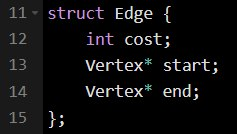
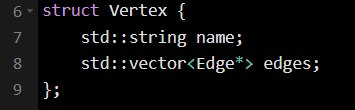
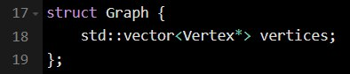
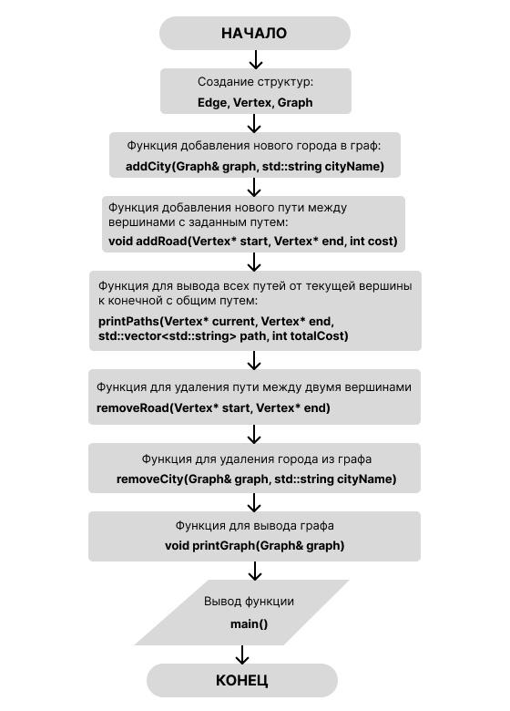
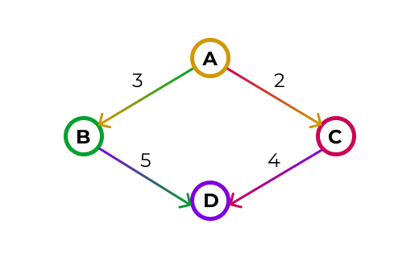
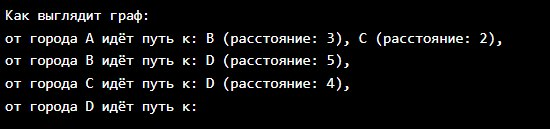
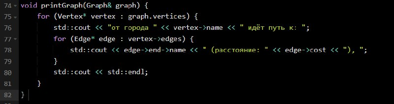
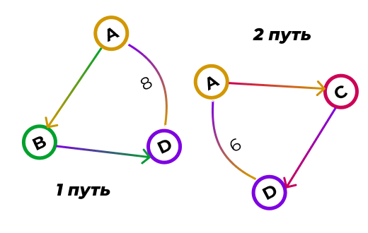
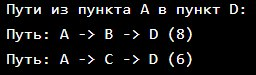
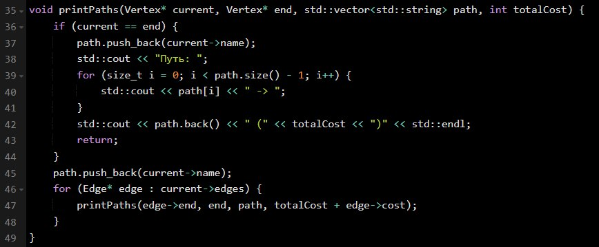

# Граф
## Задача: реализовать граф на структуре данных - иерархический список.

в этом репозитории представленна реализация графа на структуре данных - иерархический список. 

### Graf
**Graf** - это абстрактная структура данных, которая представляет собой совокупность вершин, соединенных ребрами. Граф может быть ориентированным (где рёбра имеют направление) или неориентированным (где рёбра не имеют направления). Тип графов который мы берём за основу в данном репозитории - **иерархический**.

**Иерархический граф** - это тип ориентированного графа, в котором вершины имеют иерархическую (пирамидальную или древовидную) структуру. В таком графе существует иерархия, где вершины могут быть разделены на уровни или слои, где каждая вершина на более низком уровне связана с вершиной на более высоком уровне. Этот тип графа широко используется для представления организационных структур, древовидных структур данных, семантических разборов и других информационных моделей.

  

## Схема структуры данныx

|детали структуры|структура|
|--------|--------|
||struct Edge|
||struct Vertex|
||struct Graph|

## Алгоритмы

## Контрольный пример

### Изображение города (с циклами)
|визуал|вывод в коде|код|
|--------|--------|--------|
||||

### Результаты поиска путей (без циклов)
|визуал|вывод в коде|код|
|--------|--------|--------|
||||
## Заключение
Выполненное нами задание по построению графа с использованием структуры данных иерархический список соответствует поставленным требованиям. В рамках задания были реализованы следующие функции:

- Добавление города;
- Добавление дороги;
- Вывод всех путей из одного города в другой с указанием общей протяженности;
- Удаление города;
- Удаление дороги.

Реализация всех указанных функциональностей позволяет эффективно работать с графом и выполнять различные операции с его элементами. Также можно отметить, что иерархический список на C++ может быть полезной структурой данных для представления иерархических структур, однако его эффективность зависит от специфики приложения и умения разработчика работать с указателями и управлять памятью.
