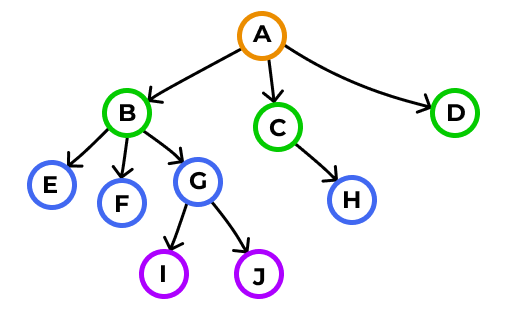

# Граф
## Задача: реализовать графа на структуре данных - иерархический список.

в этом репозитории представленна реализация графа на структуре данных - иерархический список. 

### Graf
**Graf** - это абстрактная структура данных, которая представляет собой совокупность вершин, соединенных ребрами. Граф может быть ориентированным (где рёбра имеют направление) или неориентированным (где рёбра не имеют направления). Тип графов который мы берём за основу в данном репозитории - **иерархический**.

**Иерархический граф** - это тип ориентированного графа, в котором вершины имеют иерархическую (пирамидальную или древовидную) структуру. В таком графе существует иерархия, где вершины могут быть разделены на уровни или слои, где каждая вершина на более низком уровне связана с вершиной на более высоком уровне. Этот тип графа широко используется для представления организационных структур, древовидных структур данных, семантических разборов и других информационных моделей.

  

## Схема структуры данны

|структура|детали структуры|
|--------|--------|

